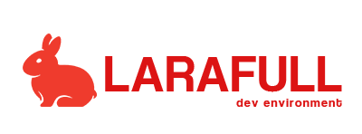

		

# *# Sobre*

Bem-vindo ao [Larafull](https://github.com/medeirosinacio/larafull), projeto baseado no framework [Laravel](https://laravel.com/) que reúne todas — ou tenta ter todas — as características e funcionalidades que qualquer sistema genérico precisa. Usando as mais atuais tecnologias, esse projeto visa prover um conjunto de ferramentas, pacotes e configuração prontas, com um ambiente completo subindo com um comando.

Principais características:

- PHP em sua última versão estável, com codigo e sua sintaxe mais atual;
- Laravel em sua última versão já com pacotes configurados (Cache, Session, DB, Seed, User, Login, Token, ACL, Log, ...);
- Template de administração pronto e componentizado para tabelas, listas, perfil, CRUD, e muito mais (chega de lidar com front-end);
- Diversas classes com funcionalidades genéricas  para estender seus modelos, migrations e validações;
- Projeto em 100% em [Docker](https://www.docker.com/) configurado para subir individualmente ou via [Vagrant](https://www.vagrantup.com/);

A documentação completa de uso e instalação pode ser lida [aqui](./docs/documentation.md).

## License

The Larafull is an open source project based on the Laravel framework licensed under the [MIT license](https://opensource.org/licenses/MIT).

