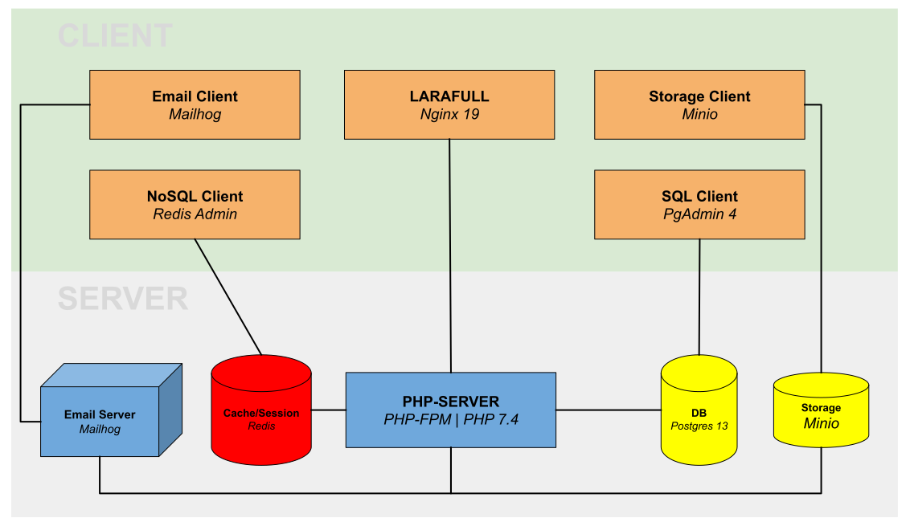
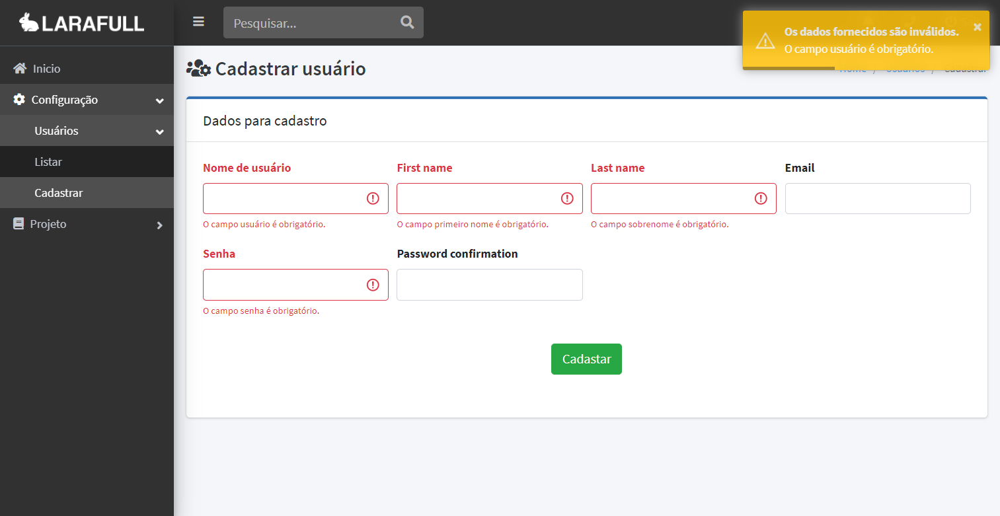

# *Índice*

- [Visão geral](visão-geral)
- [Instalação](#instalação)
   - [Vagrant](vagrant)
   - [Docker](via-docker)
- [Back-End](#back-end) 
- [Front-End](#front-end) 
   - [Criação de paginas](#criação-de-paginas)
   - [Blade Components](#blade-components)
      - [Breadcrumbs](#breadcrumbs)
- [Padrão e Estilo de Código](#padrao-e-estilo-de-codigo) 
   - [Banco de Dados](#banco-de-dados)

# *Visão geral*

[Larafull](https://github.com/medeirosinacio/larafull) é um projeto de código aberto que tem o objetivo de ser um ponto de partida para qualquer sistema mais robusto, ele usa em seu core o framework [Laravel](https://laravel.com/) com diversos pacotes adicionais já configurados, esses pacotes trazem uma gama de ferramentas, funcionalidades e atalhos para o desenvolvedor não perder tempo com o codando e configurando o ambiente, e sim se preocupar com a regra de negocio aplicada. 

O diagrama do ambiente de desenvolvimento após a instalação vai fica assim:




O diagrama é dividido em duas partes, o lado **client** que contem toda a aplicação acessível do browser,  como um cliente de e-mail para testes, clientes de banco de dados, storage e a aplicação em si. O lado **server** é como o próprio nome já diz.

&#9888; As portas e IP de acesso para as aplicações estão configuradas no arquivo [.env](../docker/.env).

# *Instalação*

A instalação pode ser feita via [Docker](https://www.docker.com/) ou via [Vagrant](https://www.vagrantup.com/), ambos os métodos trazem todo o ecossistema do Larafull. Toda a configuração do projeto se encontra no arquivo [*docker/.env*](../docker/.env), para a configuração do servidor Vagrant como IP ou recursos da maquina pode ser alterado em [*server/.env*](../server/.env).

Antes de escolher o método de instalação, clone o projeto e entre na pasta raiz:

```bash
$ git clone git@github.com:medeirosinacio/larafull.git
$ cd larafull/
```

## *Vagrant*

A instalação via Vagrant é ultra simplificada, o script DEVE instalar todas as dependências necessárias se os requisitos estiverem satisfeitos.

**Requisitos:**

- [Virtual Box 6.1](https://www.virtualbox.org/wiki/Downloads)
- [Vagrant 2.2.6](https://www.vagrantup.com/)

Tendo os requisitos listados, podemos entrar na pasta de inicialização do servidor e subir o ambiente.

```bash
$ cd server/
$ vagrant up
```

O servidor vai subir com as configurações listas em [*server/.env*](../server/.env), por padrão o IP de acesso do servidor é um NAT com endereço [192.168.70.90](https://192.168.70.90), o processo para subir o servidor pode demorar um pouco na primeira vez, ele ira subir uma maquina Linux com [Alpine](https://alpinelinux.org/), junto ira instalar os pacotes necessários para rodar o [Docker](https://www.docker.com/) , [Docker Compose](https://docs.docker.com/compose/) e todo o ecossistema incluindo banco de dados e [seed](https://laravel.com/docs/7.x/seeding).

Após o Vagrant subir o ambiente, você pode entrar no servidor com:

```bash
$ vagrant ssh
```
Seu ambiente já deve estar pronto para acessar nesse ponto da instalação, acesse o IP padrão [192.168.70.90](https://192.168.70.90) ou o que você configurou.

O servidor contem alguns [alias](https://shapeshed.com/unix-alias/) de comando para facilitar o desenvolvimento, por exemplo, ao invés de instalarmos o [Composer](https://getcomposer.org/) direto no servidor, usamos o alias:

```bash
alias composer="docker run --rm --interactive \
    --volume $PWD/../:/app \
    --volume ${COMPOSER_HOME:-$HOME/.composer}:/tmp \
    --user $(id -u):$(id -g) \
    composer"
```

Dessa maneira o Composer é executado via container e não temos ele instalado direto na maquina, outra facilidade é que a pasta correta já esta mapeada, ou seja, você pode executar o comando em qualquer pasta do servidor que sempre ele será executado no lugar certo. 

Os comandos que vai precisar são:

| Comando / Alias | Finalidade                                    |
| --------------- | --------------------------------------------- |
| composer        | Atualiza e instala pacotes PHP                |
| artisan         | Ferramenta de linha de comando para o Laravel |
| npm             | Atualiza, instala e compila pacotes JS        |


Os alias já vem configurado por padrão na instalação do vagrant, você pode testar puxando a versão de cada um com os comandos:

```bash
$ composer --version
Composer version 1.10.9
	
$ npm -v
6.14.7

$ artisan --version
Laravel Framework 7.25.0
```

&#9888; A primeira vez que você executar esses comando podem demorar um pouco pois a imagem do container pode não estar em cache.

## *Docker*

A instalação via [Docker ](https://www.docker.com/)é um pouco mais custosa, devido a pós instalação de scripts de inicialização e seeds do banco de dados, como requisitos você DEVE ter instalado:

**Requisitos:**

- [Docker](https://www.docker.com/)
- [Docker Compose](https://docs.docker.com/compose/)

Tendo os requisitos listados, podemos entrar na pasta de inicialização do docker e subir o ambiente.

```bash
$ cd docker/
$ docker-compose up -d
```

# *Back-End*

# *Front-End*

Usamos o como layout da aplicação o template [AdminLTE v3](https://adminlte.io/docs/3.0/layout.html) com [Bootstrap v4](https://getbootstrap.com/docs/4.0/getting-started/introduction/), componentizamos recursos comuns da aplicação em [componentes Blade](#blade-components) para reuso fácil e modificações centralizadas.

Para instalação do template foi usado o pacote [jeroennoten/Laravel-AdminLTE](https://github.com/jeroennoten/Laravel-AdminLTE/), consulte a documentação para saber mais da implementação e uso. 

Os assets são divididos em dois domínios para não compartilhar o código, em [*resources/views/site*](../resources/views/site) contem os arquivos disponíveis quando não á autenticação, usamos para carregar o mínimo possível de scripts e css na pagina de login ou recuperação de senha.  Em [*resources/views/painel*](../resources/views/painel) estão os privados, os scripts e css que só serão carregados no sistema, com o usuário logado, funções ajax ou estilos podem ser encontrados ai. 

## *Criação de paginas*

Todo o projeto foi montado e estruturado para o mínimo possível de repetição de layout, basicamente todas as paginas PODEM ter a mesma estrutura graças a componentização das sessões do layout, como exemplo, abaixo uma tela de cadastro qualquer, ela contem todo o layout, com breadcrumb, titulo e formulários dinâmicos.




Toda a pagina, ela contem um cadastro de usuário, incluindo a validação, nome dos campos, alertas e o layout,toda essa estrutura pode ser montada com menos de 40 linhas que você pode conferir abaixo.

```php
    @extends('layouts.app')

    @section('title', 'Cadastrar usuário')
    @section('title_icon', 'fas fa-users-cog')

    @component('layouts.partials.breadcrumb')
        @slot('breadcrumbs', [
            ['name' => 'Usuários', 'link' => '/painel/usuarios/listar'],
            ['name' => 'Cadastrar']
        ])
    @endcomponent

    @section('content')
        @component('layouts.partials.card')
        
            @slot('title', 'Dados para cadastro')

            @slot('content')
                {!! Form::ajaxOpen($user) !!}
                {!! Form::textField('username', $user) !!}
                {!! Form::textField('first_name', $user) !!}
                {!! Form::textField('last_name', $user) !!}
                {!! Form::textField('email', $user) !!}
                {!! Form::passwordField('password', $user) !!}
                {!! Form::passwordField('password_confirmation', $user) !!}
                {!! Form::submitField() !!}
                {!! Form::close() !!}
            @endslot

        @endcomponent
    @stop
```


Para outros exemplos de paginas consulte os arquivos do projeto.

Os recursos individuais de criação de HTML, siga a documentação oficial do [Laravel Collective](https://laravelcollective.com/docs/6.0/html). Se você deseja criar  componentes, siga o modelo de componentes descrito no Laravel usando [Macros](https://tighten.co/blog/the-magic-of-laravel-macros/) para o [Laravel Collective](https://laravelcollective.com/docs/6.0/html#custom-macros) ou [estendendo layouts](https://laravel.com/docs/7.x/blade#extending-a-layout).

&#9888; Para exemplos de layouts e componentes customizados, visite [***resources/views/layouts***](../resources/views/layouts) para modelos de paginas e componentes, [***app/Custom/FormServiceProvider***](../app/Custom/FormServiceProvider.php) para um exemplo de criação de macro para formulários, e [***app/Providers/MacroServiceProvider***](../app/Providers/MacroServiceProvider.php) para consultar como registramos o uso do mesmo.

## *Blade Components*

[Componentes Blades](https://laravel.com/docs/7.x/blade) são pequenos blocos de código que você pode incorporar em suas paginas, o intuito é centralizar todos os pontos em comum da aplicação, como breadcrumb, cards, modals...  Muitos componentes precisam estar em uma pagina que estenda o layout principal da aplicação, você  pode encontrar a dependência na sessão do componente.

Abaixo uma lista de componentes que a aplicação dispõe, junto com informações de sua dependência  — caso houver —, sua localização para uso e exemplo de utilização.

&#9888; Todos os layouts e componentes vão estar dentro no namespace [***resources/views/layouts***](../resources/views/layouts)

### *Breadcrumbs*

> location: [*partials/breadcrumb*](../resources/views/layouts/partials/breadcrumb.blade.php) <br>
> extends: [*app*](../resources/views/layouts/app.blade.php)

Componente responsável pela criação dos breadcrumbs da pagina,
você pode definir uma lista ou um único objeto.

Como usar:

```php
    // list breadcrumb:
    @component('layouts.partials.breadcrumb')
        @slot('breadcrumbs', [
            ['name' => 'cliente', 'link' => '/painel/cliente'],
            ['name' => 'cadastrar', 'link' => '/painel/cadastrar']
        ])
    @endcomponent

    // one breadcrumb:
    @component('layouts.partials.breadcrumb')
        @slot('breadcrumb',[
        'name' => 'cliente',
        'link' => '/painel/cliente'
        ])
    @endcomponent
```

# *Padrão e Estilo de Código*

## ***Banco de dados***

Todo o estilo e padrão utilizado para o banco de dados DEVEM seguir as recomendações da comunidade, como guia base você pode seguir o [SQL Style Guide](https://www.sqlstyle.guide/). Nomes de colunas, sufixos e prefixos são usados conforme descrito no guia, como consequência da padronização, o sistema já identifica certas colunas e formata, trata ou exibe elas já em um padrão correto, sem o desenvolvedor ter que se preocupar em validar isso mais tarde.  
