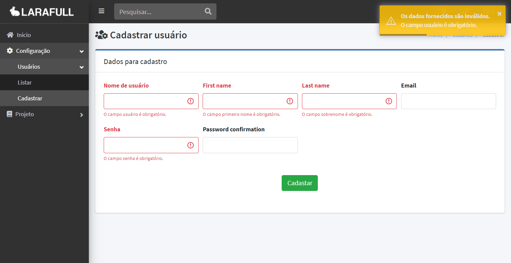

# *# Índice*

- [Sobre](/README.md)
  - [Licença](/README.md)
- Instalação
- [Layout](##layout) 
   - [Criação de paginas](#criação-de-paginas)
   - [Blade Components](#blade-components)
      - [Breadcrumbs](#breadcrumbs)

# *# Layout*

Usamos o como layout da aplicação o template [AdminLTE v3](https://adminlte.io/docs/3.0/layout.html) com [Bootstrap v4](https://getbootstrap.com/docs/4.0/getting-started/introduction/), componentizamos recursos comuns da aplicação em [componentes Blade](#blade-components) para reuso fácil e modificações centralizadas.

Para instalação do template foi usado o pacote [jeroennoten/Laravel-AdminLTE](https://github.com/jeroennoten/Laravel-AdminLTE/), consulte a documentação para saber mais da implementação e uso. 

Os assets são divididos em dois domínios para não compartilhar o código, em [*resources/views/site*](./resources/views/site) contem os arquivos disponíveis quando não á autenticação, usamos para carregar o mínimo possível de scripts e css na pagina de login ou recuperação de senha.  Em [*resources/views/painel*](../resources/views/painel) estão os privados, os scripts e css que só serão carregados no sistema, com o usuário logado, funções ajax ou estilos podem ser encontrados ai. 

## *# Criação de paginas*

Todo o projeto foi montado e estruturado para o mínimo possível de repetição de layout, basicamente todas as paginas PODEM ter a mesma estrutura graças a componentização das sessões do layout, como exemplo, abaixo uma tela de cadastro qualquer, ela contem todo o layout, com breadcrumb, titulo e formulários dinâmicos.




Toda a pagina, ela contem um cadastro de usuário, incluindo a validação, nome dos campos, alertas e o layout,toda essa estrutura pode ser montada com menos de 40 linhas que você pode conferir abaixo.

```
    @extends('layouts.app')

    @section('title', 'Cadastrar usuário')
    @section('title_icon', 'fas fa-users-cog')

    @component('layouts.partials.breadcrumb')
        @slot('breadcrumbs', [
            ['name' => 'Usuários', 'link' => '/painel/usuarios/listar'],
            ['name' => 'Cadastrar']
        ])
    @endcomponent

    @section('content')
        @component('layouts.partials.card')
        
            @slot('title', 'Dados para cadastro')

            @slot('content')
                {!! Form::ajaxOpen($user) !!}
                {!! Form::textField('username', $user) !!}
                {!! Form::textField('first_name', $user) !!}
                {!! Form::textField('last_name', $user) !!}
                {!! Form::textField('email', $user) !!}
                {!! Form::passwordField('password', $user) !!}
                {!! Form::passwordField('password_confirmation', $user) !!}
                {!! Form::submitField() !!}
                {!! Form::close() !!}
            @endslot

        @endcomponent
    @stop
```


Para outros exemplos de paginas consulte os arquivos do projeto.

Os recursos individuais de criação de HTML, siga a documentação oficial do [Laravel Collective](https://laravelcollective.com/docs/6.0/html). Se você deseja criar  componentes, siga o modelo de componentes descrito no Laravel usando [Macros](https://tighten.co/blog/the-magic-of-laravel-macros/) para o [Laravel Collective](https://laravelcollective.com/docs/6.0/html#custom-macros) ou [estendendo layouts](https://laravel.com/docs/7.x/blade#extending-a-layout).

&#9888; Para exemplos de layouts e componentes customizados, visite [***resources/views/layouts***](./resources/views/layouts) para modelos de paginas e componentes, [***app/Custom/FormServiceProvider***](./app/Custom/FormServiceProvider.php) para um exemplo de criação de macro para formulários, e [***app/Providers/MacroServiceProvider***](./app/Providers/MacroServiceProvider.php) para consultar como registramos o uso do mesmo.

## *# Blade Components*

[Componentes Blades](https://laravel.com/docs/7.x/blade) são pequenos blocos de código que você pode incorporar em suas paginas, o intuito é centralizar todos os pontos em comum da aplicação, como breadcrumb, cards, modals...  Muitos componentes precisam estar em uma pagina que estenda o layout principal da aplicação, você  pode encontrar a dependência na sessão do componente.

Abaixo uma lista de componentes que a aplicação dispõe, junto com informações de sua dependência  — caso houver —, sua localização para uso e exemplo de utilização.

&#9888; Todos os layouts e componentes vão estar dentro no namespace [***resources/views/layouts***](./resources/views/layouts)

### *Breadcrumbs*

> location: [*partials/breadcrumb*](./resources/views/layouts/partials/breadcrumb.blade.php) <br>
> extends: [*app*](./resources/views/layouts/app.blade.php)

Componente responsável pela criação dos breadcrumbs da pagina,
você pode definir uma lista ou um único objeto.

Como usar:

        // list breadcrumb:
        @component('layouts.partials.breadcrumb')
            @slot('breadcrumbs', [
                ['name' => 'cliente', 'link' => '/painel/cliente'],
                ['name' => 'cadastrar', 'link' => '/painel/cadastrar']
            ])
        @endcomponent
    
        // one breadcrumb:
        @component('layouts.partials.breadcrumb')
            @slot('breadcrumb',[
            'name' => 'cliente',
            'link' => '/painel/cliente'
            ])
        @endcomponent
